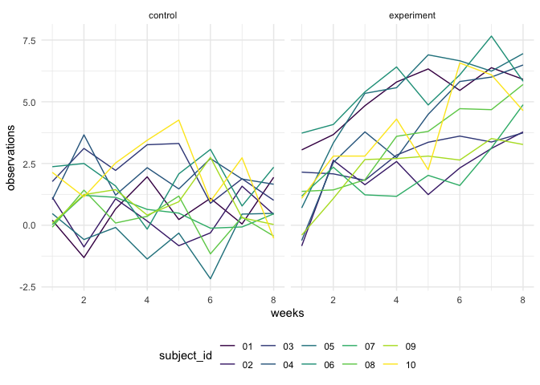

Homework 5
================
Paula Wu
11/15/2021

Import the libraries

``` r
library(tidyverse)
```

## Problem 2

``` r
# read in data sets, store in a data frame
study_df = 
  tibble(rel_path = list.files("./data", pattern = ".csv")) %>% 
  mutate(path = str_c("./data/", rel_path),
         content = map(.x = path, ~read_csv(.x))) %>% 
  separate(rel_path, into = c("arms", "subject_id")) %>% 
  mutate(arms = as.factor(recode(arms, "con" = "control", "exp" = "experiment"))) %>% 
  select(-path) %>% 
  unnest(content)
```

``` r
# make a spaghetti plot
study_df %>% 
  pivot_longer(week_1:week_8, 
               names_to = "weeks", 
               names_prefix = "week_", 
               values_to = "observations") %>% 
  mutate(weeks = as.numeric(weeks)) %>% 
  ggplot(aes(x = weeks, y = observations, group = subject_id)) +
  geom_line(aes(color = subject_id)) +
  facet_grid(.~arms)
```

<!-- -->

## Problem 3

``` r
set.seed(10)
iris_with_missing = iris %>% 
  map_df(~replace(.x, sample(1:150, 20), NA)) %>%
  mutate(Species = as.character(Species)) %>% 
  janitor::clean_names()  # just to tidy things up
```

``` r
# function to address problems
iris_impute = function(col_vec){
  if(is.character(col_vec)){
    col_vec = replace_na(col_vec, "virginica")
  }else if(is.numeric(col_vec)){
    vec_mean = mean(col_vec, na.rm = TRUE)
    col_vec = replace_na(col_vec, vec_mean)
  }
}
iris_filled = 
  map(iris_with_missing, iris_impute) %>% 
  as_tibble() 
iris_filled %>% skimr::skim()
```

|                                                  |            |
|:-------------------------------------------------|:-----------|
| Name                                             | Piped data |
| Number of rows                                   | 150        |
| Number of columns                                | 5          |
| \_\_\_\_\_\_\_\_\_\_\_\_\_\_\_\_\_\_\_\_\_\_\_   |            |
| Column type frequency:                           |            |
| character                                        | 1          |
| numeric                                          | 4          |
| \_\_\_\_\_\_\_\_\_\_\_\_\_\_\_\_\_\_\_\_\_\_\_\_ |            |
| Group variables                                  | None       |

Data summary

**Variable type: character**

| skim_variable | n_missing | complete_rate | min | max | empty | n_unique | whitespace |
|:--------------|----------:|--------------:|----:|----:|------:|---------:|-----------:|
| species       |         0 |             1 |   6 |  10 |     0 |        3 |          0 |

**Variable type: numeric**

| skim_variable | n_missing | complete_rate | mean |   sd |  p0 |  p25 |  p50 |  p75 | p100 | hist  |
|:--------------|----------:|--------------:|-----:|-----:|----:|-----:|-----:|-----:|-----:|:------|
| sepal_length  |         0 |             1 | 5.82 | 0.78 | 4.3 | 5.12 | 5.82 | 6.38 |  7.9 | ▅▆▇▃▂ |
| sepal_width   |         0 |             1 | 3.08 | 0.40 | 2.0 | 2.82 | 3.08 | 3.27 |  4.4 | ▁▃▇▂▁ |
| petal_length  |         0 |             1 | 3.77 | 1.60 | 1.0 | 1.70 | 4.00 | 4.97 |  6.9 | ▆▁▇▆▂ |
| petal_width   |         0 |             1 | 1.19 | 0.72 | 0.1 | 0.40 | 1.20 | 1.80 |  2.5 | ▆▁▇▃▃ |

Results shown by `skimr::skim()` shows the completeness of the dataset.
