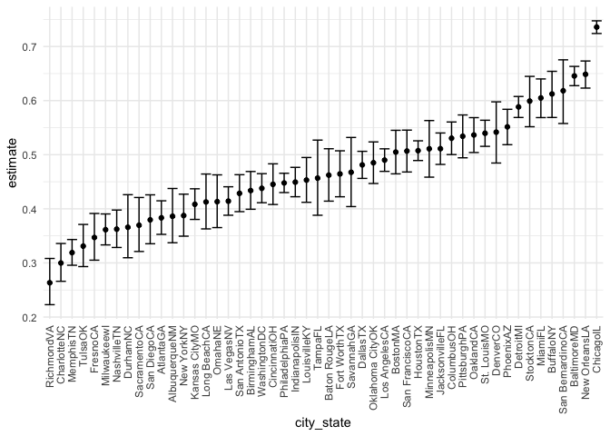
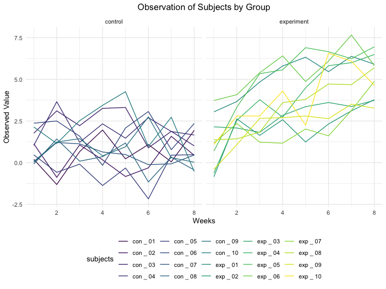

Homework 5
================
Paula Wu
11/15/2021

Import the libraries

``` r
library(tidyverse)
```

## Problem 1

This answer is not part of the homework requirement. Just for
self-practice purpose

``` r
# first clean the data set
homicide_df = 
  read_csv("./data/homicide-data.csv", na = c("", "Unknown")) %>%  # account for empty/unknown entries
  mutate(
    city_state = str_c(city, state),
    resolution = case_when(
      disposition == "Closed without arrest" ~ "unsolved",
      disposition == "Open/No arrest" ~ "unsolved",
      disposition == "Closed by arrest" ~ "solved"
    )) %>% 
  relocate(city_state) %>% 
  filter(city_state != "TulsaAL")
```

First focus on Baltimore, MD

``` r
baltimore_df = 
  homicide_df %>% 
  filter(city_state == "BaltimoreMD")

baltimore_summary = 
  baltimore_df %>% 
  summarize(
    unsolved = sum(resolution == "unsolved"),
    n = n() 
  )

baltimore_test =
  prop.test(
    x = baltimore_summary %>% pull(unsolved), 
    n = baltimore_summary %>% pull(n))

baltimore_test %>% # for better presentation of the test results
  broom::tidy()
```

    ## # A tibble: 1 × 8
    ##   estimate statistic  p.value parameter conf.low conf.high method    alternative
    ##      <dbl>     <dbl>    <dbl>     <int>    <dbl>     <dbl> <chr>     <chr>      
    ## 1    0.646      239. 6.46e-54         1    0.628     0.663 1-sample… two.sided

Then extend this to the rest of the data set: iterate across cities

``` r
prop_test_function = function(city_df){
  city_summary = 
    city_df %>% 
    summarize(
      unsolved = sum(resolution == "unsolved"),
      n = n())

  city_test =
    prop.test(
      x = city_summary %>% pull(unsolved), 
      n = city_summary %>% pull(n))

  return(city_test)
}
```

``` r
results_df = 
  homicide_df %>% 
  nest(data = uid:resolution) %>% 
  mutate(
    test_results = map(data, prop_test_function),
    tidy_results = map(test_results, broom::tidy)
  ) %>% 
  select(city_state, tidy_results) %>% 
  unnest(tidy_results) %>% 
  select(city_state, estimate, starts_with("conf"))  # get the confidence interval and estimate
```

Make a plot showing estimates and confidence interval

``` r
results_df %>% 
  mutate(city_state = fct_reorder(city_state, estimate)) %>% 
  ggplot(aes(x = city_state, y = estimate)) +
  geom_point() +
  geom_errorbar(aes(ymin = conf.low, ymax = conf.high)) +
  theme(axis.text.x = element_text(angle = 90, vjust = 0.5, hjust=1))
```

<!-- -->
<br> Another way to solve the question using `map2()`, will not evaluate
here for concision purpose

``` r
homicide_df %>% 
  group_by(city_state) %>% 
  summarize(
    unsolved = sum(resolution == "unsolved"),
    n = n()
  ) %>% 
  mutate(
    test_results = map2(unsolved, n, prop.test),
    tidy_results = map(test_results, broom::tidy)
  ) %>% 
  select(city_state, tidy_results) %>% 
  unnest(tidy_results) %>% 
  select(city_state, estimate, starts_with("conf"))
```

<br>

## Problem 2

``` r
# read in data sets, store in a data frame
study_df = 
  tibble(rel_path = list.files("./data/p2_data", pattern = ".csv")) %>% 
  mutate(path = str_c("./data/p2_data/", rel_path),  # add prefix to data path
         content = map(.x = path, ~read_csv(.x))) %>% 
  separate(rel_path, into = c("arms", "subject_id")) %>% 
  mutate(arms = as.factor(recode(arms, "con" = "control", "exp" = "experiment"))) %>% 
  select(-path) %>% 
  unnest(content)
```

``` r
# make a spaghetti plot
study_df %>% 
  pivot_longer(week_1:week_8, 
               names_to = "weeks", 
               names_prefix = "week_", 
               values_to = "observations") %>% 
  mutate(weeks = as.numeric(weeks)) %>% 
  ggplot(aes(x = weeks, y = observations, group = subject_id)) +
  geom_line(aes(color = subject_id)) +
  ggtitle("Observation of Subjects by Group") +
  theme(plot.title = element_text(hjust = 0.5)) +
  labs(x = "Weeks", y = "Observed Value") +
  facet_grid(.~arms)
```

<!-- -->
<br> As we can see from the above spaghetti plot, there’s a clear
positive trend in the experiment group as time goes by. On the contrary,
the overall trend in the control group is nearly horizontal.<br>

## Problem 3

``` r
set.seed(10)
iris_with_missing = iris %>% 
  map_df(~replace(.x, sample(1:150, 20), NA)) %>%
  mutate(Species = as.character(Species)) %>% 
  janitor::clean_names()  # just to tidy things up
```

``` r
# function to address problems
iris_impute = function(col_vec){
  if(is.character(col_vec)){
    col_vec = replace_na(col_vec, "virginica")
  }else if(is.numeric(col_vec)){
    vec_mean = mean(col_vec, na.rm = TRUE)
    col_vec = replace_na(col_vec, vec_mean)
  }
  return(col_vec)
}

# applied the function to the iris_with_missing dataset
iris_filled = 
  map(iris_with_missing, iris_impute) %>% 
  as_tibble() 
```

<br>Finally, I generate a table that counts NA values of the
`iris_filled` dataset to demonstrate efficacies of the `iris_impute`
function

``` r
iris_filled %>% 
  select(everything()) %>%  
  summarise_all(funs(sum(is.na(.)))) %>% 
  knitr::kable()
```

| sepal_length | sepal_width | petal_length | petal_width | species |
|-------------:|------------:|-------------:|------------:|--------:|
|            0 |           0 |            0 |           0 |       0 |

Results above show the completeness of the data set after applying the
`iris_impute()` function to `iris_with_missing` data set.
